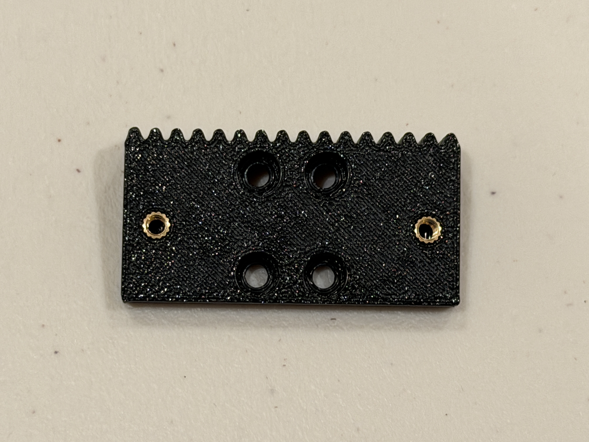
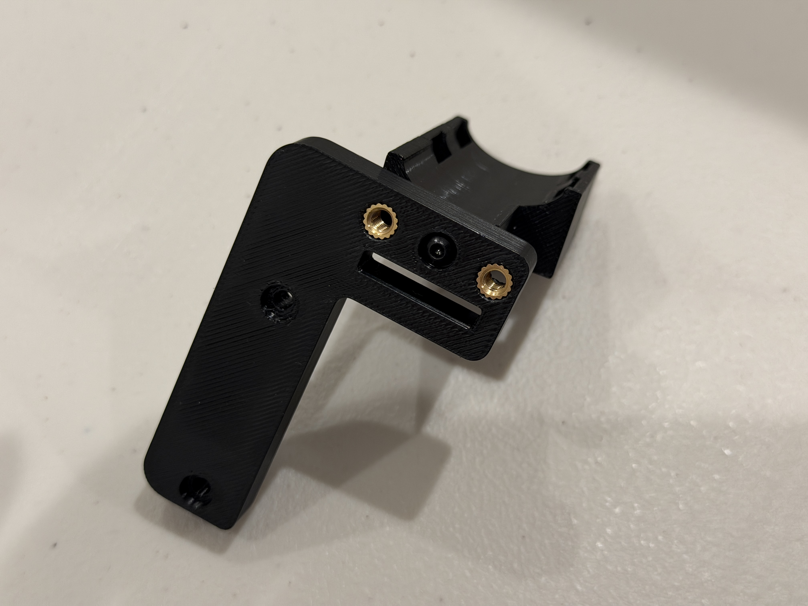
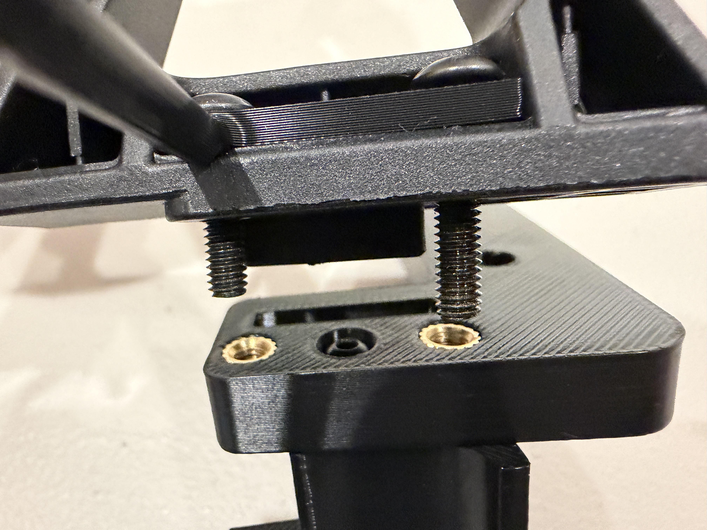
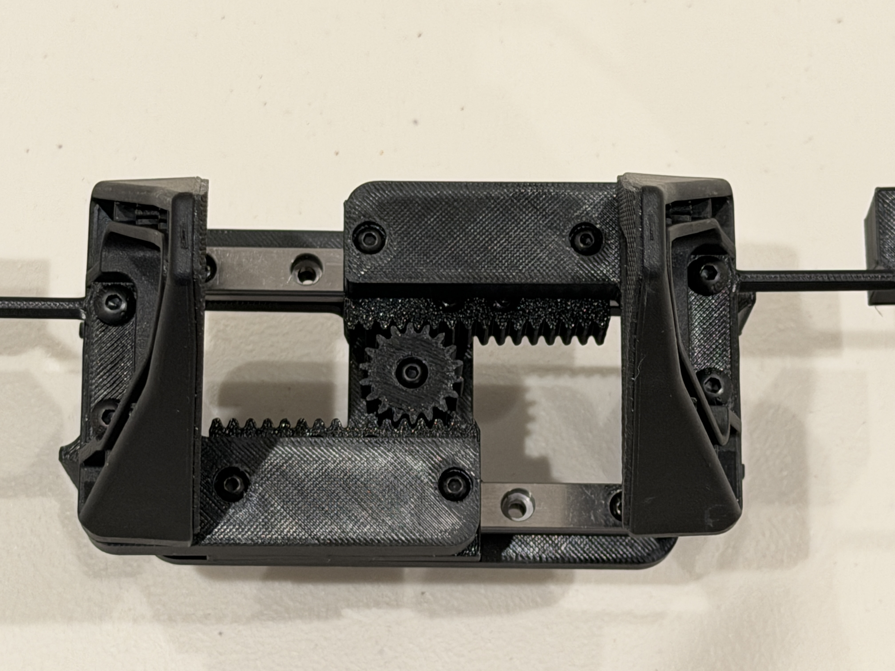
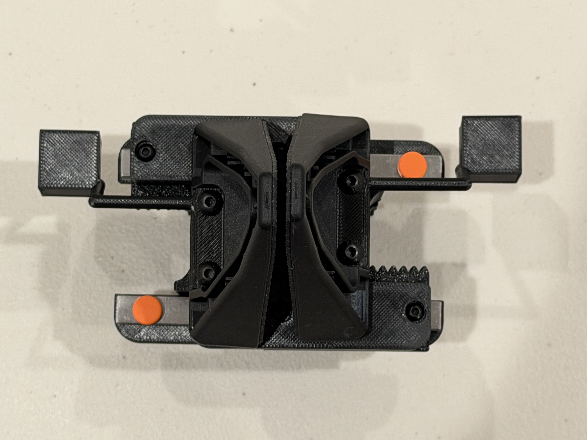
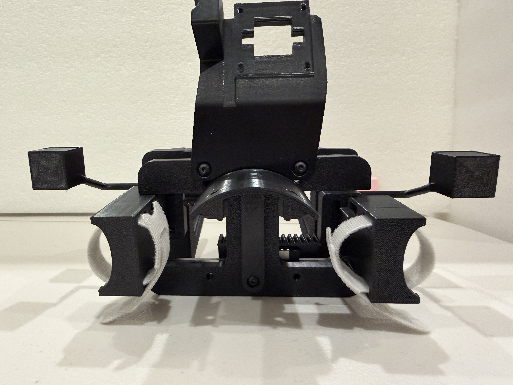
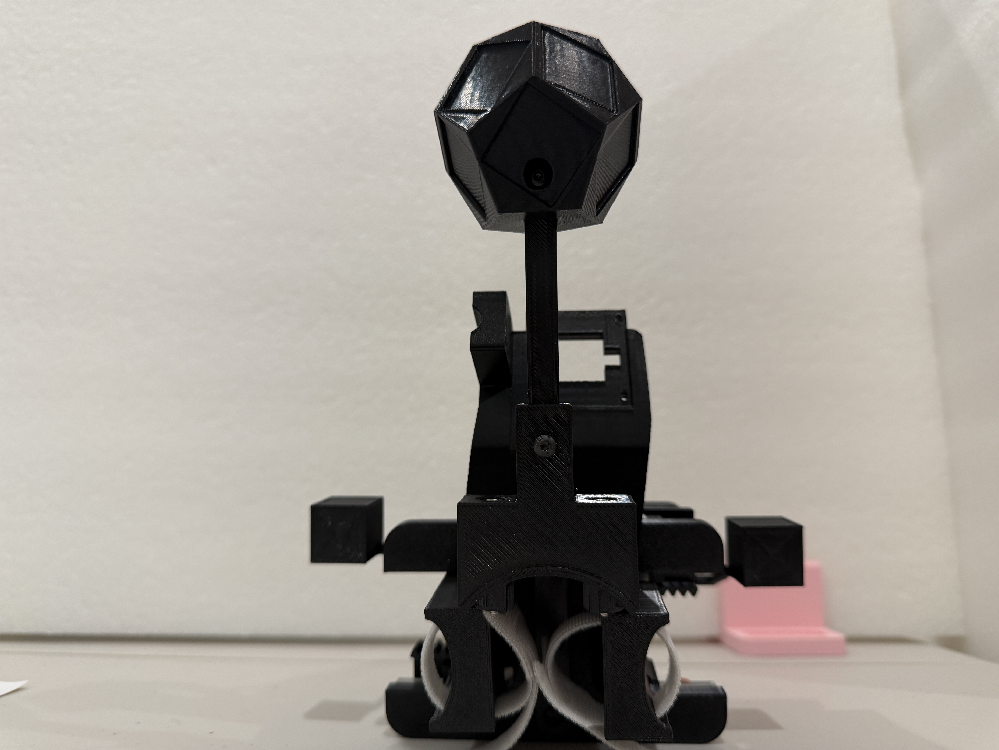

# YAM-UMI Assembly Guide

YAM-UMI is a hand-worn, two-finger gripper. Your fingers open and close the handles, while two racks remain coupled through a central pinion; the wrist camera moves with the gripper and records the grasping area.

The assembly sequence is: **Prepare the parts → Base plate and rails → Racks and pinion → Gripper fingers and handles → Straps → Wrist camera → Finger markers → Optional marker ball → Final checks.** After installing each set of moving parts, check that opening and closing remain smooth before continuing.

The photo below shows the gripper with its wrist camera and optional marker ball. The marker ball lets a fixed external camera track the gripper's position and orientation; skip the marker-ball assembly if you use only the wrist camera for pose estimation.

## 0. Before You Start

### Identify the Main Parts

| Name | Shape and function | File or source | Quantity per assembly |
|---|---|---|---:|
| Base plate | H-shaped plate supporting the rails and central pinion | `plate_v6` | 1 |
| Rack adapter | Rectangular block with teeth along one edge, connecting the carriage to the gripper-finger assembly | `adapter_v10` | 2 |
| Central pinion | Meshes with both racks to couple their motion | `pinion_z18_deep_v0` through `v3`; install one variant | 1 |
| L bracket | Connects the gripper finger, handle, and rack adapter | `L_bracket_v4` | 2 |
| Finger handle | Curved finger cradle with strap slots | `handle_v14` | 2 |
| Gripper finger | Contacts the object directly, with a rubber gripping surface on the inside | Stock YAM "Linear 4310" gripper fingers | 2 |
| Rails and carriages | Constrain the gripper fingers to linear motion | MGN9 100 mm rails and MGN9C carriages | 2 each |
| Camera mount and cover | Secure the wrist fisheye camera | `YAM_linear_gripper_fisheye_camera_mount_main` and `_cover` | 1 each |
| Wrist camera | Records the grasping area and the markers on the gripper fingers | Arducam fisheye USB camera compatible with the mount | 1 |
| Hook-and-loop straps | Secure your fingers to the handles | Straps approximately 6 inches long | 2 |

Print files are in the [gripper STL directory](../hardware/STL/). The four pinion sizes are for test fitting; install only the one that turns most smoothly. Use stock YAM gripper fingers, which do not need to be printed. Parts for the optional marker-ball assembly are listed in Section 7.

Some photos show thin rods extending to either side of the gripper, ending in square platforms. These are marker extensions for the external-camera setup and are not required for the basic YAM-UMI assembly; the photos illustrate the shared gripper structure.

### Tools and Supplies

Prepare hex tools that fit the screws, a soldering iron with a heat-set insert tip, calipers, small scissors, M3/M4 screws, heat-set inserts, double-sided tape, and matte paper for the markers. PETG can be used for the printed parts; remove supports and burrs, paying particular attention to the tooth gaps, mounting holes, and mating surfaces.

`M3 × 12 mm` means a screw with a nominal thread diameter of 3 mm and a length of 12 mm; the non-countersunk screws used in this guide are measured from beneath the head to the tip. **M3 and M4 are not interchangeable.** Start each screw by hand for a few turns to check that the threads engage smoothly before using a tool.

Where a screw length is not specified, choose the shortest screw of the correct thread size that fully engages the insert and brings the two parts together. If a screw stops turning while a gap remains between the parts, its tip may have reached the bottom of the hole; do not force it. Use a shorter screw and check the hole alignment. Do not choose screw lengths solely from the amount of exposed thread in a photo.

### Install Heat-Set Inserts First

Heat-set inserts are internally threaded brass fittings embedded in printed parts, allowing screws to be installed repeatedly. Install them before assembling the parts, while the holes are easy to reach.

1. Lay the printed part flat and identify the insert seats. Plain through-holes are only for screws to pass through; do not press inserts into every hole.
2. Choose inserts that fit the seats. Use M3 inserts that are 5 mm long with a 4 mm outside diameter; the outside diameter and length of the M4 inserts must match the seats in the L brackets.
3. Heat the insert with the installation tip and slowly press it along the hole axis, keeping it perpendicular. Position it against the seat in the printed part so that protruding brass does not prevent adjacent parts from mating.
4. Let the plastic cool before test fitting a screw. If an insert is tilted, loose, or turns with the screw, repair the connection before continuing.

The soldering iron and freshly installed inserts are very hot; do not touch them with your hands.

## 1. Base Plate and Rails

The two parallel rails each carry a carriage for one gripper finger. First confirm the base plate's orientation, then secure the rails and check that the carriages move smoothly.

### Required Parts

| Part | Quantity |
|---|---:|
| Base plate | 1 |
| MGN9 100 mm linear rail | 2 |
| MGN9C carriage | 2, one per rail |
| Mounting screws compatible with the rail holes and base-plate inserts | 4, two per rail |

### Orient the Base Plate

Install the base plate's heat-set inserts before mounting the rails. Align the inserts with their holes so that tilted or protruding inserts do not prevent the parts from mating.

The photo below shows the rail-mounting face of the base plate. Five inserts are visible: one at each corner and one in the center. Keep this face upward when installing the rails.

The opposite face has four visible inserts, oriented as shown below.

### Secure the Rails

1. Place the two rails in their mounting positions on either side of the base plate, parallel to each other, with the carriage mounting faces upward.
2. Align the rail holes with the mounting holes in the base plate. Use two screws per rail, positioned as shown below. Start the screws, then tighten them gradually until the rails sit flush against the plate.
3. Keep the rail end stops in place during assembly to prevent a carriage from sliding off the rail and shedding its ball bearings.

### Check Sliding Motion

Gently push each carriage and check that it moves smoothly throughout the usable rail travel. The rails must be secure, with no looseness between the rails and base plate. If a carriage binds, check that the rail sits flat and the mounting screws are properly seated before installing the rack adapters.

## 2. Rack Adapters and Central Pinion

Each adapter is secured to a carriage and carries one rack. The central pinion meshes with both racks, making the adapters move together in opposite directions.

### Required Parts

| Part | Quantity |
|---|---:|
| Rack adapter | 2 |
| M3 heat-set inserts for the adapters | 4, two per adapter |
| M3 × 6 mm screws for the adapter-to-carriage connections | 8, four per adapter |
| Central pinion | 1 |
| MR63ZZ bearings, 3 mm bore, 6 mm outside diameter, 2.5 mm thick | 2 |
| M3 × 16 mm screw serving as the pinion axle | 1 |

### Install the Rack Adapters

The four central mounting holes in each adapter attach it to the carriage. The heat-set inserts on either side are used later to attach the gripper-finger assembly. Install these inserts before securing the adapter to the carriage.

1. Place one adapter on each carriage, with the toothed edges facing each other toward the center of the base plate.
2. Align the four adapter holes with the threaded holes in the carriage and secure each adapter with four M3 × 6 mm screws.
3. Move each adapter independently to check that it still slides smoothly along its rail and does not interfere with the base plate or rail ends.

### Install the Central Pinion

The pinion comes in four fit variants, `pinion_z18_deep_v0` through `v3`. Test fit them and choose the one that meshes smoothly with both racks without binding.

1. Insert the two bearings one after the other into the pinion's deeper central seat, stacking them coaxially to a total thickness of 5 mm. The shallow counterbore on the opposite face accommodates the screw head; do not reverse the two faces.
2. Place the pinion between the racks with its bearing-seat face toward the base plate. Gently move the adapters and rotate the pinion until both racks mesh with it; do not force it into place while tooth tips are pressing against each other.
3. Insert the M3 × 16 mm screw from above the pinion, pass it through the bearings, and thread it into the central insert in the base plate. Keep the axle screw perpendicular to the plate so the pinion does not tilt.
4. Turn the axle screw in gradually until the pinion is stably located but can still rotate freely. Do not tighten it so far that the screw head presses against the pinion and restricts rotation.

### Check Coupled Motion

Gently push either adapter; the other should move with it in the opposite direction through the central pinion. Move them back and forth within the rail stops, checking that the pinion turns steadily, both racks remain engaged, and there is no binding or tooth skipping.

If resistance increases noticeably after installing the pinion, first check whether the axle screw is clamping the pinion, the pinion is tilted, or the pinion-to-rack fit is too tight. Confirm that the transmission moves smoothly before installing the gripper-finger assemblies.

## 3. Gripper Fingers and Finger Handles

First combine each gripper finger with an L bracket and handle to form a subassembly, then attach it to a rack adapter. The gripper fingers face the object, and the handles sit on the operator's side; the rubber gripping surfaces face each other.

### Required Parts

| Part | Total for both sides |
|---|---:|
| YAM "Linear 4310" gripper fingers | 2 |
| L brackets `L_bracket_v4` | 2 |
| Handles `handle_v14` | 2 |
| M3 heat-set inserts for the handles | 2, one per handle |
| M4 heat-set inserts for the L brackets | 4, two per bracket |
| M3 × 12 mm screws | 6, one per side to secure the handle and two per side to attach the rack adapter |
| M4 gripper-finger mounting screws | 4, two per side; select 16 mm or 20 mm according to the thickness of the parts traversed at each hole |

### Attach the Handles to the L Brackets

Each handle has a curved finger cradle, strap slots, and mounting holes in its end face. First install an M3 insert in its seat, leaving the other hole clear for the anti-rotation fit.

1. Install M4 inserts in the two seats on the short leg of the L bracket.
2. Place the end face of the handle against the back of the bracket's short leg. Align the central M3 mounting hole and the anti-rotation hole.
3. Insert an M3 × 12 mm screw from the L-bracket side and thread it into the handle's M3 insert. Once secured, the parts should sit flush with no looseness.

`handle_v14` is secured with an M3 screw and does not require an additional M4 nut on its side.

### Secure the Gripper Fingers

1. Place the gripper finger's mounting face against the short leg of the L bracket, aligning the two mounting holes with the M4 inserts.
2. Insert two M4 screws from the gripper-finger side. Choose their lengths according to the thickness of the parts traversed at each hole, so they fully engage the inserts without bottoming out.
3. Start both screws in their threads, then tighten them gradually, alternating between them, until the gripper finger sits flush against the bracket. Do not use screw-tightening force to pull misaligned holes into position.
4. Assemble the other side in the same way, with the rubber gripping surfaces facing each other.

### Attach the Gripper-Finger Assemblies to the Rack Adapters

1. Align the two holes in the long leg of each L bracket with the M3 inserts on either side of its rack adapter.
2. Secure each side with two M3 × 12 mm screws. The gripper finger should move with its rack adapter, with the handle facing the operator's fingers.
3. Slowly move the gripper fingers and check for interference during opening and closing. Both sides should open and close together through the central pinion, without tooth skipping that allows one side to stop while the other continues moving.

The photos below show the open and closed positions. The marker rods extending outward on both sides are optional extensions and do not change the basic connections described here.

If a rack adapter hits a rubber cap at the end of a rail, trim only the interfering upper portion of the cap, preserving the part that prevents the carriage from sliding off. Do not remove the entire end stop.

## 4. Straps and Fit

Use one hook-and-loop strap per handle: one side for the thumb, and the other for the index finger or the index and middle fingers together.

1. Choose a pair of strap slots on each handle that suits your finger position. Thread a strap through the slots to form a loop over the curved finger cradle.
2. Place your finger in the cradle, adjust the strap length, and fasten it. The strap should let you pull the handle open without constricting your finger.
3. Slowly pinch and open a few times. Check that your fingers can move the gripper naturally, both sides move smoothly, and neither your fingers nor the straps enter the moving areas of the pinion, racks, or carriages.

The spare slots on each handle allow you to adjust strap position. Start with one strap on each side, then adjust for your hand shape.

## 5. Wrist Camera

The wrist camera is mounted above the base plate, with its lens facing the working area in front of the gripper fingers. The mount establishes the lens position and angle relative to the fingers. Keep the original mounting holes and structure, and do not arbitrarily add spacers that change the angle.

### Required Parts

| Part | Quantity |
|---|---:|
| Camera mount body `YAM_linear_gripper_fisheye_camera_mount_main` | 1 |
| Camera mount cover `YAM_linear_gripper_fisheye_camera_mount_cover` | 1 |
| Fisheye USB camera and cable compatible with the mount | 1 set |
| M3 × 8 mm screws for securing the mount | 2 |
| Screws compatible with the camera-board and cover mounting holes | Enough for the actual mounting holes |

### Secure the Mount and Camera

1. Place the camera mount in its matching position on the back of the base plate, with the lens-opening end above the gripper. Secure the bottom of the mount with two M3 × 8 mm screws.
2. Place the camera board in its matching seat, with the lens aligned with and protruding through the mount opening. Align the board and mount holes, then secure the board with matching screws.
3. Position the cover against its mating surfaces, checking that it does not press on camera components or cables, then secure it. Choose screw lengths that hold it securely without pressing against the circuit board.
4. Connect the USB cable and route it along the fixed structure, leaving slack for hand movement. The cable must not pass between the gripper fingers, near the pinion, or through the carriages' travel paths.

The photo below shows the mount's orientation; the camera board fits at the upper opening. The curved part below is the extension bracket for the optional tracking assembly, installed in Section 7.

### Check the Camera View

Connect the camera to a computer and open its feed in a program that can preview USB cameras. Point the gripper at the actual working area and check that both gripper fingers and the target object appear in the frame. Slowly open and close the gripper and rotate your wrist, checking that the video remains continuous and the cable does not pull on the mount.

Roughly adjust the lens until the fingers and working area are clear; perform final focusing after applying the finger markers in Section 6.

## 6. Gripper Aperture Markers

The wrist camera uses the black-and-white markers on the gripper fingers to estimate the distance between them. Apply one marker to each finger where the camera can see it in both the open and closed positions.

### Print and Cut the Markers

1. Open the [glove marker print file](../pos-tracking/glove_markers_v4.pdf) and select the **tips WRIST** group in the left column: AprilTag 16h5, IDs 2 (A) and 3 (B).
2. Print at **100% / Actual size**, with "Fit to page" and all automatic scaling disabled. Check the printed 100 mm scale bar with calipers.
3. Check that the black square of each finger marker measures 6 mm per side; the cut size including the white border is 8 mm. Cut around the outer edge, preserving the white border around the marker.

### Position and Apply the Markers

1. Clean the flat surface of each gripper finger that faces the wrist camera. Choose an area approximately 25 mm from the base of the finger where the entire marker can lie flat. The marker must not cross an edge or cover the rubber gripping surface that contacts objects.
2. Cover the entire back of the marker with double-sided tape, then press it flat into place. Do not attach only the corners, as a curled surface can interfere with detection.
3. Apply one ID to each gripper finger, preserving the two distinct numbers rather than using the same ID twice. Record which ID is on which finger for the data-collection configuration.
4. In the camera preview, slowly move the fingers from closed to open. Both markers should remain fully within the frame, with clear edges and black-and-white cells, unobstructed by the gripper bodies or cables.

If a marker is difficult to see near the edge of the fisheye image, adjust its position within the finger's flat area, favoring a location away from the heavily distorted image edge; do not fold the paper around the side of the finger.

### Set the Final Focus

At the working distance of the gripper fingers and the object, slowly rotate the lens barrel until the marker edges are sharp. Check once with the gripper open and once with it closed, then secure the lens locking ring.

**Finish focusing before calibrating the camera.** Calibration establishes the relationship between image coordinates and physical geometry; turning the lens again changes the imaging parameters, so a focal-length adjustment requires recalibration.

## 7. Marker-Ball Tracking Assembly (Optional)

A fixed external camera uses the patterns on the marker ball to estimate the gripper's position and orientation. For this tracking method, install the extension bracket, rod mount, rod, and marker ball; skip this section if you use only the wrist camera for pose estimation.

### Required Parts

Print files are in the [marker-ball assembly directory](../pos-tracking/wrist_dodecahedron_marker/).

| Name | File | Quantity |
|---|---|---:|
| Arc extension bracket | `arc_extender` | 1 |
| Rod mount | `wrist_stalk_arc_adapter` | 1 |
| 80 mm rod | `stalk_rod_80mm` | 1 |
| Dodecahedral marker ball | `dodeca_marker_ball_v2` | 1 |
| M3 screws and inserts compatible with the connection holes | As required for the holes | 1 set |

### Install the Bracket, Rod, and Ball

1. Secure the arc extension bracket to the back of the base plate, with its slender support arm along the back of the plate and its upper curved section providing a seat for the rod mount. See the photo in Section 5 for its position relative to the camera mount.
2. Seat the curved bottom of the rod mount against the extension bracket, with its square socket facing upward. Align the mounting holes and install the screws. Keep the mating surfaces flush; do not overtighten and deform the printed parts.

3. Insert the rod into the square socket, align the mounting holes, and secure it. The rod should be stable and must not wobble in the socket.
4. Attach the marker ball to the other end of the rod and secure it with an M3 screw. **Secure the ball to the rod before applying markers** so that a sticker does not cover the screw's installation point.
5. Gently hold the ball and bracket to check the connections for looseness. Put on the gripper and slowly rotate your wrist to check that the ball, bracket, camera, and hand do not collide.

### Apply the Ball Markers

1. From the **dodecahedron ball** group in the left column of the same [glove marker print file](../pos-tracking/glove_markers_v4.pdf), select the eleven ArUco markers with IDs 25–35.
2. Again, print at 100% / Actual size. Each black marker is 15 mm per side, and the square tile including the white border is 19.5 mm per side.
3. Apply the eleven markers to eleven faces of the ball, one per face with no duplicate IDs. Cover each marker's entire back with double-sided tape, keep it flat, and do not bridge edges between faces.
4. No fixed ID order is required; preserve the ball's actual layout for subsequent calibration. Do not swap stickers after calibration.

The ball patterns use the `DICT_4X4_100` dictionary. The tails and base groups in the right column of the sheet belong to a different extension setup and are not used in this assembly.

Aim the external camera at the full working area so that the marker ball stays in frame when the gripper is raised or rotated, and avoid prolonged occlusion by your hand or the camera cable. Before tracking, calibrate the camera and the relative positions of the ball's markers; each ball's calibration must be stored with that specific physical unit.

## 8. Final Checks

First check the gripper without an object, then grasp something light and non-fragile. Pass each check before preparing for data collection.

| Check | Procedure and pass condition |
|---|---|
| Fixed connections | Gently wiggle the gripper fingers, handles, and brackets; no connection is loose, and no insert turns with its screw |
| Coupled opening and closing | Slowly open and close the gripper several times; both sides move together, the pinion stays engaged, and there is no binding or tooth skipping |
| Travel and end stops | Adapters do not hit fixed parts during opening or closing, and carriages cannot leave the rails |
| Grasping contact | Both rubber gripping surfaces contact a light object, with no tilting of the gripper fingers |
| Fit | Straps do not constrict your fingers; you can open and close the gripper naturally without touching the transmission |
| Wrist camera view | The camera is secure, video is continuous, and the fingers and working area are clearly visible |
| Finger markers | Both markers remain fully visible and sharp throughout opening and closing, with no curled paper edges |
| Cables | Rotating your wrist or opening the gripper does not pull on connectors or draw cables between moving parts |
| Optional marker ball | The ball and rod mount are secure, stickers are flat with distinct IDs, and the ball remains within the external camera's view during operation |

After the hardware checks, keep the lens focal length, marker positions, and bracket connections unchanged, then follow your data-collection software's calibration and trial-recording procedure. Completing the mechanical assembly does not by itself provide usable pose or aperture data.

## 9. Troubleshooting

| Symptom | Checks and corrective action |
|---|---|
| A carriage slides smoothly on its own but becomes stiff after the adapter is installed | Check whether the adapter's underside sits flat, the screws are too long, or the adapter hits a rail end cap |
| Resistance increases noticeably after the pinion is installed | Check whether the axle screw presses against the pinion or the pinion is tilted; try a pinion size that meshes more smoothly |
| The two sides do not move together, or teeth skip | Check that the toothed edges face each other, the pinion meshes with both racks, and the adapters and pinion are secure |
| A screw will not turn further but a gap remains between the parts | Check for a bottomed-out screw, misaligned holes, or remaining print supports; do not force the screw |
| An insert turns with its screw | Stop tightening and repair the insert mounting; replace the printed part if its insert seat is damaged |
| A marker is obscured when the gripper closes | Use the camera preview to identify the obstruction, reposition the marker within the flat area, and recheck the full travel |
| Marker edges are blurred or reflective | Check focus, paper flatness, and lighting; use matte paper and avoid direct light reflections into the lens |
| The marker ball leaves the frame or is hidden by your hand | Adjust the external camera framing to leave room for lifting the gripper, and check the bracket's position relative to your hand |
